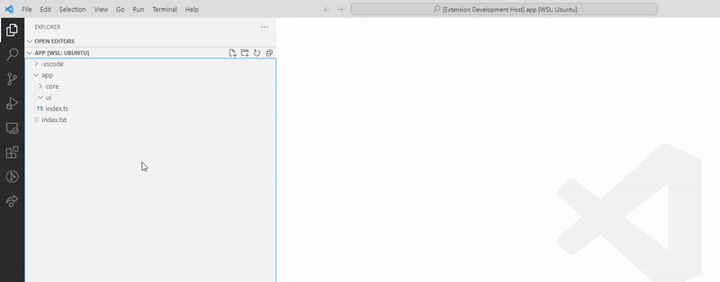

# Eucalyptus

**Eucalyptus** is an extension for VS Code that helps you create UI directory with predefined templates for React applications.

## Templates
When creating a directory, you will be asked to select one of the prepared templates

Diamond Template
Contains files: component, style, and index
Ruby Template
Contains files: component and index
Sapphire Template
Contains files: component and style
Emerald Template
Contains files: style and index

## Configuration

`eucalyptus.settings.useTypescript` - specify whether TypeScript should be used for UI component  
_Default: `true`_

`eucalyptus.settings.styleFormat` - specify the style format for UI component;  
_Available Options: `css`, `scss`, `less`_  
_Default: `scss`_
        
`eucalyptus.settings.useCssModules` - specify whether to use CSS Modules for importing styles for UI component  
_Default: `true`_
        
`eucalyptus.settings.shouldOpenAfterCreation` - should the UI directory files be opened after creation or not  
_Default: `false`_

## Installation

[Install](https://marketplace.visualstudio.com/items?itemName=WoodenHands.eucalyptus) the **Eucalyptus** extension from the Marketplace in VS Code.

